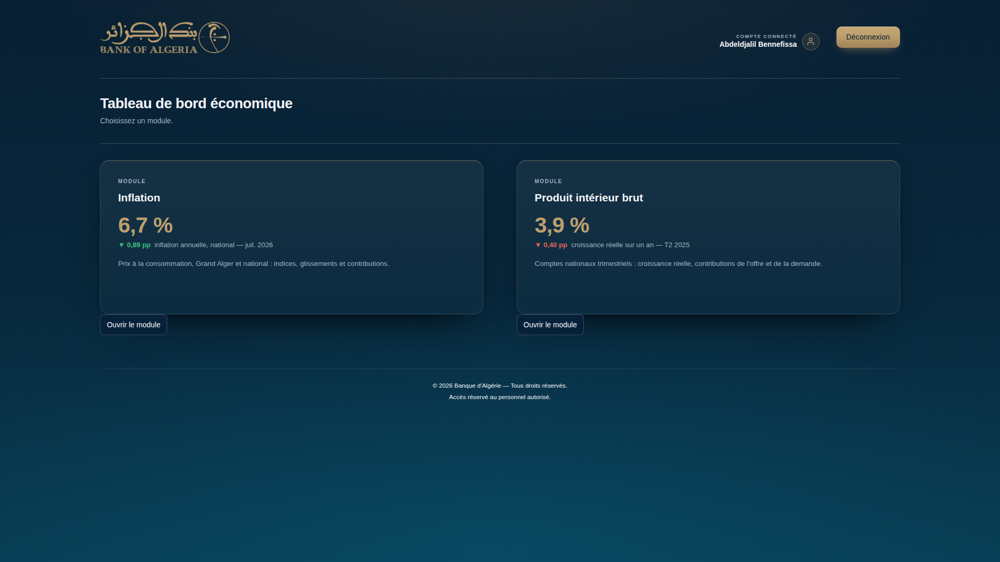
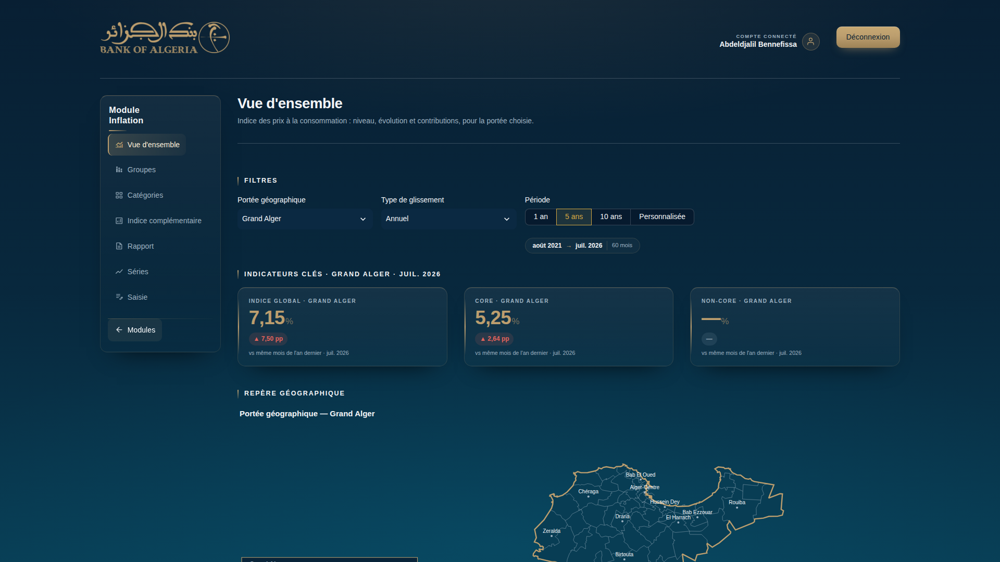
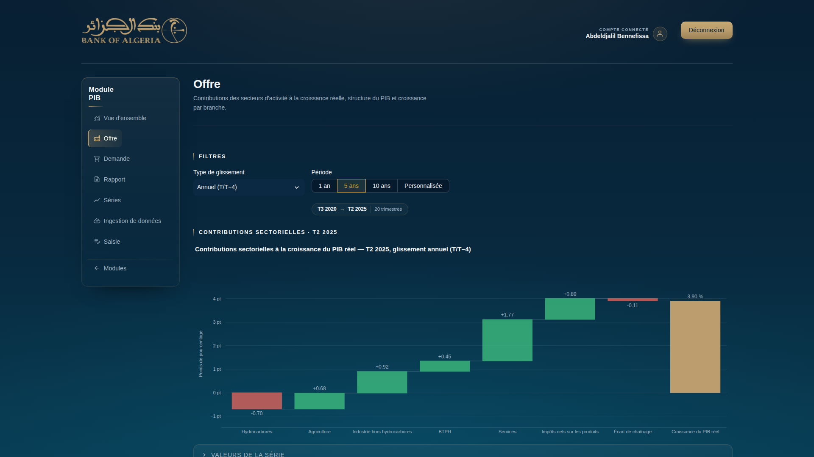
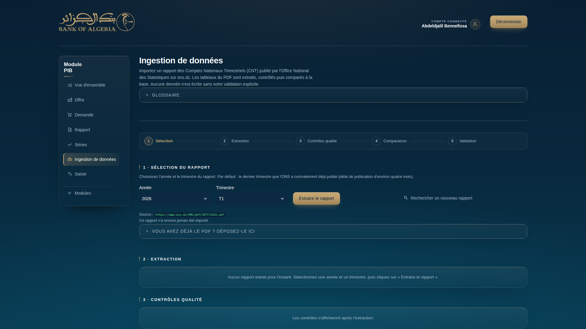

# Tableau de bord Inflation et PIB — Banque d'Algérie

Application Streamlit de suivi de deux indicateurs macroéconomiques :

- **Inflation** : indice des prix à la consommation (IPC), mensuel, pour le
  Grand Alger et l'ensemble du territoire national.
- **PIB** : comptes nationaux trimestriels de l'ONS (croissance, déflateur,
  contributions de l'offre et de la demande), avec ingestion des rapports
  CNT publiés sur ons.dz.

Chaque module produit un rapport PDF éditorial, rédigé par un moteur de
règles déterministe (aucun modèle de langage).

| Accueil | Inflation — vue d'ensemble |
|---|---|
|  |  |
| **PIB — offre** | **PIB — ingestion de données** |
|  |  |

---

## Sommaire

1. [Prérequis](#1-prérequis)
2. [Installation et premier lancement](#2-installation-et-premier-lancement)
3. [Se connecter](#3-se-connecter)
4. [Page d'accueil](#4-page-daccueil)
5. [Guide du module Inflation](#5-guide-du-module-inflation)
6. [Guide du module PIB](#6-guide-du-module-pib)
7. [Architecture](#7-architecture)
8. [Configuration](#8-configuration)
9. [Données](#9-données)
10. [Méthodologie et formules](#10-méthodologie-et-formules)
11. [Rapports PDF](#11-rapports-pdf)
12. [Tests](#12-tests)
13. [Déploiement](#13-déploiement)
14. [Dépannage](#14-dépannage)
15. [Sources, licences et évolutions](#15-sources-licences-et-évolutions)

---

## 1. Prérequis

| Outil | Version | Pourquoi | Lien |
|---|---|---|---|
| **Python** | 3.11 ou plus récent | Exécute l'application | [python.org/downloads](https://www.python.org/downloads/) |
| **pip** | fourni avec Python | Installe les dépendances | — |
| **Git** *(facultatif)* | récent | Cloner/versionner le projet | [git-scm.com](https://git-scm.com/downloads) |
| **Docker Desktop** *(facultatif)* | récent | Déploiement en conteneur (§13) | [docker.com/products/docker-desktop](https://www.docker.com/products/docker-desktop/) |

Aucune autre bibliothèque système n'est nécessaire : pas de GTK/Pango, pas de
navigateur pour générer les PDF. Windows, Linux et macOS sont supportés de
façon identique.

**Vérifier l'installation de Python** (dans un terminal) :

```bash
python --version        # doit afficher Python 3.11.x ou plus
```

Sous Windows, si `python` n'est pas reconnu, réinstallez Python en cochant
**« Add python.exe to PATH »** pendant l'installation.

---

## 2. Installation et premier lancement

### 2.1 Récupérer le projet

Si vous avez le dossier du projet en local, passez directement à l'étape
suivante. Sinon, avec Git :

```bash
git clone <url-du-dépôt>
cd Dashboard-Inflation-PIB
```

### 2.2 Créer un environnement virtuel

Un environnement virtuel (« venv ») isole les bibliothèques Python de ce
projet du reste de votre machine, pour éviter tout conflit de versions avec
d'autres projets Python. À la racine du projet :

**Windows (PowerShell) :**

```powershell
python -m venv .venv
.venv\Scripts\Activate.ps1
```

*(Si PowerShell refuse le script avec une erreur de « exécution de scripts
désactivée », lancez d'abord `Set-ExecutionPolicy -Scope Process
RemoteSigned`, une fois par session de terminal.)*

**Linux / macOS :**

```bash
python -m venv .venv
source .venv/bin/activate
```

Une fois activé, le terminal affiche `(.venv)` au début de la ligne — c'est
le signe que les commandes `python`/`pip` qui suivent utiliseront bien cet
environnement isolé, pas l'installation Python globale de la machine.

### 2.3 Installer les dépendances

```bash
pip install -r requirements.txt
```

Cette commande installe à la fois les bibliothèques tierces (Streamlit,
pandas, Plotly, ReportLab…) et **le projet lui-même** en mode éditable
(la ligne `-e .` en fin de fichier) : c'est ce qui permet aux pages de faire
`from backend... import ...` sans erreur. Comptez une à deux minutes selon la
connexion.

### 2.4 Créer un premier compte

L'authentification est un simple fichier Excel `data/users.xlsx` (colonnes
`username`, `password`, en clair — voir §8 pour le détail). Il n'existe pas
encore au premier lancement ; créez-le avec :

```bash
python -c "import pandas as pd; pd.DataFrame({'username': ['mon.identifiant'], 'password': ['mon-mot-de-passe']}).to_excel('data/users.xlsx', index=False)"
```

Remplacez `mon.identifiant` / `mon-mot-de-passe` par ce que vous voulez.
Vous pourrez ajouter d'autres comptes plus tard de la même façon (§8).

### 2.5 Lancer l'application

```bash
streamlit run app/Home.py
```

Le terminal affiche une adresse locale, en général **http://localhost:8501**
— ouvrez-la dans un navigateur. Pour arrêter l'application, `Ctrl+C` dans le
terminal.

### 2.6 Premiers calculs

Les fichiers de résultats ne sont pas fournis tout faits : ils se
construisent à partir des sources.

- **Inflation** : allez sur la page **Saisie** (menu de gauche, module
  Inflation) et cliquez **« Recalculer les indicateurs »** en bas de page
  (§5.7). Sans ce clic, les pages Inflation affichent « Les données de cette
  page sont momentanément indisponibles. ».
- **PIB** : ouvrez n'importe quelle page du module PIB (ex. **Vue
  d'ensemble**) — la base `data/dashboard.db` se construit automatiquement,
  seule, à partir des classeurs ONS déjà présents dans `data/raw/pib/`.

### 2.7 Pour aller plus vite : tout en une fois

```bash
python -m venv .venv
.venv\Scripts\activate            # Windows  (Linux / macOS : source .venv/bin/activate)
pip install -r requirements.txt
python -c "import pandas as pd; pd.DataFrame({'username': ['mon.identifiant'], 'password': ['mon-mot-de-passe']}).to_excel('data/users.xlsx', index=False)"
streamlit run app/Home.py
```

### 2.8 Environnement de développement

Pour lancer les tests ou le linter (voir §12), une couche d'outils
supplémentaire :

```bash
pip install -r requirements-dev.txt   # pytest, ruff, pymupdf (lecture des PDF dans les tests)
```

### 2.9 Docker (alternative à l'environnement virtuel)

Le projet fournit un `Dockerfile` prêt à l'emploi :

```bash
docker build -t dashboard-bda .
docker run -p 8501:8501 -v "$PWD/data:/app/data" dashboard-bda
```

Le montage `-v` rend `data/` (comptes, base PIB, saisies) persistant d'un
redémarrage du conteneur à l'autre. Voir §13 pour un déploiement complet
(Streamlit Community Cloud ou Docker en production).

---

## 3. Se connecter

Ouvrez l'URL de l'application : elle affiche toujours d'abord la page
**Connexion**, quel que soit le lien visité (`require_auth()` y redirige
automatiquement toute page interne tant que vous n'êtes pas identifié).

1. Saisissez votre **nom d'utilisateur** et votre **mot de passe** (les
   comptes vivent dans `data/users.xlsx`, voir §2.4 et §8).
2. Cliquez **« Se connecter »**.
3. Vous êtes redirigé vers la page d'accueil.

En cas d'erreur, le message est volontairement générique (« Nom
d'utilisateur ou mot de passe invalide. ») sans préciser lequel des deux
champs est en cause, par prudence. Le lien **« Mot de passe oublié ? »**
n'a pas de flux automatique : il affiche seulement un message invitant à
contacter l'administrateur (c'est-à-dire : quelqu'un ayant accès au fichier
`data/users.xlsx`, voir §8).

Il n'existe qu'un seul niveau d'accès : tout compte authentifié voit
l'intégralité de l'application, y compris les pages de saisie et
d'ingestion — il n'y a plus de distinction admin/lecteur.

Pour se déconnecter, le bouton **« Déconnexion »** est visible en haut à
droite sur toutes les pages internes.

---

## 4. Page d'accueil

Après connexion, la page d'accueil présente les deux modules côte à côte,
chacun sous forme de carte :

- un **indicateur clé** en gros (dernière inflation annuelle nationale pour
  la carte Inflation, dernière croissance réelle sur un an pour la carte
  PIB), avec sa variation par rapport à la période précédente et la date de
  la donnée ;
- une **description** du module et trois **étiquettes** résumant son
  contenu (ex. « National & Grand Alger », « Contributions par groupe »,
  « Rapport PDF ») ;
- un bouton **« Ouvrir le module »** qui amène sur la page « Vue
  d'ensemble » du module choisi.

Si aucun calcul n'a encore été fait (voir §2.6), la carte affiche
« Aucune donnée d'inflation calculée pour le moment. » ou « Aucune donnée
PIB en base pour le moment. » à la place de l'indicateur — ce n'est pas une
erreur, juste l'état avant le premier recalcul/la première ouverture d'une
page PIB.

---

## 5. Guide du module Inflation

Toutes les pages du module partagent la même ossature : en-tête (logo,
compte connecté), navigation latérale (**Vue d'ensemble, Groupes,
Catégories, Indice complémentaire, Rapport, Séries, Saisie**), une section
« Filtres », puis les graphiques — chacun suivi de son tableau de valeurs,
exportable en CSV depuis un panneau rétractable.

### 5.1 Vue d'ensemble

Indice des prix à la consommation, niveau et contributions, pour la portée
choisie.

**Filtres :**
- **Portée géographique** : « Grand Alger » ou « National ». Change
  entièrement les séries affichées (voir §9, la décomposition core/non-core
  n'existe qu'au niveau Grand Alger).
- **Type de glissement** : « Annuel » (t/t−12) ou « Mensuel » (t/t−1).
- **Période** : raccourcis « 1 an / 5 ans / 10 ans / Personnalisée » (§5.6
  pour le détail de ce sélecteur, commun à toutes les pages).

**Contenu :** une carte de l'Algérie (contour doré ; communes du Grand
Alger visibles en portée Grand Alger), trois indicateurs clés, un graphique
d'évolution et un graphique de contributions en points de pourcentage. La
portée pilote l'ensemble de la page en une seule fois.

### 5.2 Groupes

Évolution et contribution des huit groupes de produits composant le panier.

**Filtres :** Portée géographique, Type de glissement (Annuel/Mensuel),
Période — mêmes contrôles qu'en Vue d'ensemble, indépendants d'une page à
l'autre.

**Contenu :** graphique + tableau « Évolution des groupes », puis graphique
+ tableau « Contributions des groupes » (en points de pourcentage).

### 5.3 Catégories

Biens alimentaires, biens manufacturés et services — une décomposition qui
n'existe qu'au niveau **Grand Alger** (pas de sélecteur de portée sur cette
page, volontairement : elle n'aurait pas de sens au niveau national).

**Filtres :** Type de glissement, Période.

**Contenu :** graphique + tableau « Évolution des catégories », puis
graphique + tableau « Contributions des catégories ».

### 5.4 Indice complémentaire

Trois indices publiés uniquement au niveau **national** : Réglementés,
Fort Contenu d'Import (FCI), et l'inflation sous-jacente 2 (hors produits
réglementés, hors agricole frais).

**Filtres :** Type de glissement, Période.

**Contenu :** quatre indicateurs clés (Indice global national, Réglementés,
Fort contenu d'import, Sous-jacente 2), puis un graphique unique superposant
les quatre séries. Ces trois indices sont calculés à la source et intégrés
tels quels — l'application ne les recalcule pas.

### 5.5 Rapport

Génère le rapport mensuel PDF.

1. Choisissez le **mois du rapport** dans la liste déroulante (le plus
   récent mois calculé est proposé par défaut).
2. Cliquez **« Générer le rapport »** — un indicateur de chargement
   s'affiche pendant la génération.
3. Une fois généré, un bloc **« Document »** apparaît avec le bouton
   **« Télécharger le rapport »** (PDF) et la taille du fichier.

Le texte d'analyse est rédigé par un moteur de règles déterministe
(`config/narrative_rules.json`, voir §11) — pas de génération par IA. Si la
génération échoue, un message invite à réessayer ou consulter le journal de
l'application.

### 5.6 Séries

Explorateur libre : n'importe quelle série, sur n'importe quelle période,
dans la représentation de votre choix.

**Sélection :**
- **Périmètre** : le panier/la feuille source (Grand Alger, National,
  Catégories…).
- **Mesure** : la famille de séries à explorer dans ce périmètre (indice,
  contribution, etc. — les options dépendent du périmètre choisi).
- **Représentation** : change selon la mesure —
  - mesure « Indice » → **Lignes** ou **Base 100** (chaque série
    ramenée à 100 à son premier point connu, pour comparer des évolutions
    relatives indépendamment du niveau) ;
  - mesure « Contribution… » → **Barres empilées**, **Lignes** ou
    **Aires empilées** ;
  - une mesure de taux → **Lignes** ou **Barres**.
- **Séries comparées** : sélection multiple parmi les séries disponibles
  (4 premières cochées par défaut).
- **Superposer un agrégat** *(si disponible)* : ajoute une courbe de
  référence (ex. l'indice global) par-dessus le graphique, ou « Aucun ».
- **Période** : raccourcis 1 an / 5 ans / 10 ans, ou **Personnalisée**
  (apparition de deux listes « Début » / « Fin » listant chaque mois
  disponible).

**Résultat, du haut vers le bas :**
1. Le graphique (titre reprenant les choix ci-dessus).
2. **Synthèse sur la période** : un tableau par série (dernière valeur,
   variation sur la période, minimum, maximum, moyenne).
3. Un panneau rétractable **« Afficher les valeurs de la série »** avec le
   tableau complet et un bouton **« Exporter en CSV »**.

### 5.7 Saisie

Réservée à la saisie manuelle mensuelle et au recalcul — c'est ici que se
joue tout ce qui alimente les autres pages du module.

**Mois de référence :** une liste déroulante propose jusqu'à 6 mois
candidats ; le premier proposé suit le dernier mois déjà couvert par
l'ensemble des paniers.

**Saisie panier par panier :** un panneau rétractable par panier (Excel).
Dans chaque panneau :
1. Rappel des trois derniers mois connus (lecture seule).
2. Un tableau éditable, une ligne pour le mois choisi, une colonne par poste
   du panier.
3. Bouton **« Valider ce panier »** :
   - un panier **partiellement** rempli est refusé (« tout ou rien » : soit
     toutes les cases du panier, soit aucune) ;
   - un panier **entièrement vide** est ignoré ;
   - un panier **complet** passe par la détection d'anomalies (comparaison à
     l'historique par z-score, niveau et variation, même mois des années
     précédentes) :
     - anomalie **modérée** : avertissement affiché, mais la valeur est
       enregistrée immédiatement ;
     - anomalie **grave** : rien n'est enregistré tant que vous n'avez pas
       coché **« Je confirme ces valeurs malgré l'alerte »** puis cliqué
       **« Enregistrer quand même »**.

**Modifier une valeur** (corriger un mois déjà enregistré) : choisissez
**Feuille**, **Élément**, **Mois**, la valeur actuelle s'affiche ; entrez la
nouvelle valeur, cliquez **« Vérifier la valeur »** (même détection
d'anomalies), puis **« Confirmer la modification »** (une case à cocher est
exigée en cas d'alerte grave).

**Mise à jour des indicateurs :** une fois la saisie du mois terminée,
cliquez **« Recalculer les indicateurs »** — **cette étape n'est jamais
automatique**, tant qu'elle n'est pas faite, le tableau de bord et les
rapports reflètent encore l'ancien calcul. Le bouton **« Voir le tableau de
bord »** amène directement sur la Vue d'ensemble.

---

## 6. Guide du module PIB

Même ossature que le module Inflation : navigation latérale (**Vue
d'ensemble, Offre, Demande, Rapport, Séries, Ingestion de données,
Saisie**), filtres, puis graphiques accompagnés de leur tableau.

### 6.1 Vue d'ensemble

Niveau du PIB, croissance réelle totale et hors hydrocarbures, déflateur
implicite.

**Filtres :** **Type de glissement** — « Annuel (T/T−4) » ou « Trimestriel
(T/T−1) » — et **Période** (raccourcis trimestriels, §6-note).

**Contenu :** quatre indicateurs clés (PIB nominal, croissance réelle,
croissance hors hydrocarbures, déflateur), un graphique de croissance
réelle par agrégat (hydrocarbures / hors hydrocarbures / PIB total), puis un
graphique croissance nominale face à réelle (l'écart entre les deux mesure
l'inflation implicite de chaque agrégat).

### 6.2 Offre

Contributions sectorielles à la croissance réelle, sur toute la période
sélectionnée (barres empilées par secteur + courbe de la croissance totale
du PIB réel, avec une barre « Écart de chaînage » quand la non-additivité
des volumes chaînés l'exige — voir §10), puis structure du PIB nominal par
secteur (barres empilées à 100 %), puis un tableau de croissance QoQ et YoY
par branche.

**Filtres :** Type de glissement, Période.

*(Le rapport PDF, lui, conserve en plus un waterfall du dernier trimestre —
§11 — plus lisible sur une page imprimée qu'une vue multi-trimestres.)*

### 6.3 Demande

Contributions des emplois finals à la croissance réelle : consommation des
ménages, consommation publique, investissement (FBCF), exportations nettes
(X − M), et une ligne résiduelle « variations de stocks et écart
statistique » qui absorbe ce que l'ONS ne publie pas de façon exploitable
en volume — la somme reboucle toujours exactement sur la croissance
publiée. Puis taux d'investissement et taux d'ouverture commerciale.

**Filtres :** Type de glissement, Période.

### 6.4 Rapport

Génère le rapport trimestriel PDF — mêmes étapes que le rapport Inflation
(§5.5) : choisir le **trimestre du rapport**, cliquer **« Générer le
rapport »**, puis **« Télécharger le rapport »**.

### 6.5 Séries

Même explorateur que l'Inflation (§5.6 : périmètre, mesure, représentation,
séries comparées, période), à fréquence trimestrielle, sur les blocs de la
base CNT (Valeurs / Croissance, Offre et Demande). Un bouton **« Superposer
le PIB total »** (activé par défaut) ajoute la courbe totale par-dessus les
séries choisies quand elle existe pour ce bloc.

### 6.6 Ingestion de données

Import d'un rapport CNT publié par l'ONS, en cinq étapes suivies par un
indicateur de progression en haut de page. Rien n'est écrit dans la base
avant l'étape 5 — les quatre premières sont sans risque, y compris les
téléchargements.

Un panneau **« Glossaire »** en haut de page définit Rapport/millésime,
Révision, Tidy, Blocs, et la différence entre une Erreur (bloquante) et un
Avertissement (informatif).

1. **Sélection** — choisissez **Année** et **Trimestre**, puis :
   - **« Extraire le rapport »** télécharge et lit directement ce
     trimestre depuis ons.dz ;
   - **« Rechercher un nouveau rapport »** teste si l'ONS a publié le
     prochain trimestre attendu (délai de publication habituel : environ
     quatre mois) et propose de le préparer automatiquement ;
   - si ons.dz est injoignable, un panneau **« Vous avez déjà le PDF ? »**
     permet de déposer le fichier manuellement (**« Extraire ce
     fichier »**).
2. **Extraction** — nombre d'observations lues, résumé par bloc, et un
   bouton **« Télécharger l'Excel »** disponible immédiatement (ce fichier
   n'affecte jamais la base).
3. **Contrôles qualité** — chaque contrôle (tableaux attendus présents,
   absence de doublons/valeurs manquantes, cohérence trimestre/annuel,
   postes reconnus, croissances plausibles…) est classé OK / Avertissement /
   Erreur. Une seule **Erreur** bloque l'injection à l'étape 5. Un panneau
   **« Comprendre les contrôles… »** explique chacun en langage courant.
4. **Comparaison avec la base** — combien d'observations sont nouvelles,
   combien sont des **révisions** (correction ONS d'une valeur déjà en
   base) par rapport au rapport précédent, avec le détail exportable en CSV.
5. **Validation et injection** — si tous les contrôles sont passés,
   cochez **« Je confirme l'injection de N observations… »** puis cliquez
   **« Injecter en base »**. L'écriture est atomique : en cas d'incident,
   la base reste dans son état antérieur. Réinjecter un rapport déjà présent
   ne remplace que sa propre version, jamais les autres rapports.

En bas de page, un **historique des imports** (rapport, date, nombre de
lignes) reste toujours visible.

### 6.7 Saisie

Insertion, modification ou suppression d'une valeur trimestrielle isolée
(pour une correction ponctuelle, hors ingestion d'un rapport complet). Les
classeurs ONS ne sont jamais réécrits (ils sont pilotés par formules) :
chaque saisie est consignée dans un journal, puis le socle de la base est
reconstruit à partir des classeurs + journal.

1. Choisissez **Fichier** (Offre/Demande), **Onglet**, **Série** et
   **Action** (Insérer / Modifier / Supprimer).
2. Choisissez le **Trimestre** visé ; la valeur actuelle s'affiche si elle
   existe.
3. Pour une insertion/modification, renseignez la **nouvelle valeur** (en
   millions DA).
4. Cliquez **« Vérifier »** : la même détection d'anomalies que
   l'Inflation s'applique, adaptée au trimestre.
5. Cliquez **« Enregistrer »** (une confirmation par case à cocher est
   exigée en cas d'anomalie grave, ou pour toute suppression).

Un **journal des saisies PIB** est visible en bas de page, exportable en
CSV. Une valeur saisie n'est pas propagée par les formules ONS : pensez à
corriger séparément le prix courant et le volume si les deux doivent
changer.

*Note commune aux deux modules — le sélecteur de Période :* les raccourcis
proposés (« 1 an », « 5 ans », « 10 ans ») sont automatiquement limités à
l'historique réellement disponible ; **« Personnalisée »** fait apparaître
deux listes « Début »/« Fin » énumérant chaque mois (ou trimestre) présent
dans les données — jamais de granularité au jour, qui serait une fausse
précision sur une série mensuelle ou trimestrielle.

---

## 7. Architecture

```
app/                      Interface Streamlit (mise en page et filtres uniquement)
  Home.py                 Accueil : choix du module
  pages/                  Une page par fichier ; préfixe = ordre (00 connexion, 0x Inflation, 1x PIB)
  components/             Briques partagées : thème, en-tête et navigation (registre des
                          pages), cartes KPI, graphique + tableau, explorateur de séries,
                          stepper, journal, contrôle d'accès
backend/                  Toute la logique, sans dépendance à Streamlit
  inflation/              calculator (IPC, glissements, contributions), visualizer (Plotly),
                          portee (choix des séries par portée), reporting (rapports PDF,
                          interface unique de rendu), data_entry, anomaly_detection, series
  pib/                    lecture_ons (classeurs ONS), calculator (croissance, déflateur,
                          contributions, ratios), visualizer, ons_cnt (extraction des PDF CNT),
                          base_cnt (base SQLite, millésime 0), series, data_entry
  common/                 moteur_pdf (ReportLab), statistiques, journal, excel_io
  auth/users.py           Ancien système bcrypt/rôles — inutilisé, conservé sans être appelé
config/                   settings.py (tous les chemins), textes.py (libellés partagés),
                          branding.py (charte), *.json (pondérations, règles narratives,
                          schéma PIB, anomalies)
data/
  raw/inflation/          Sources IPC (Fichier_de_donnes.xlsx, Data_inflation.xlsx)
  raw/pib/                Classeurs ONS PIB_TR_S.xlsx (offre), PIB_TR_D.xlsx (demande)
  processed/              Fichiers de calculs générés (hors dépôt)
  sauvegardes/            Copies de secours des sources
  dashboard.db            Base CNT (générée, hors dépôt)
  users.xlsx              Comptes (hors dépôt) ; modèle : users.example.xlsx
assets/                   Logos, polices (Montserrat, Inter), fonds de carte GeoJSON
scripts/                  Anciens scripts bcrypt (obsolètes, voir §8), préparation des fonds de carte
tests/                    Suite pytest (données factices dédiées)
docs/                     Audits, guide de déploiement, captures d'écran
outputs/                  Graphiques PNG et rapports PDF générés (hors dépôt)
logs/                     Journal de l'application (hors dépôt)
```

Principes : les pages n'effectuent aucun calcul ; tous les chemins passent
par `config/settings.py` (aucun chemin relatif fragile, aucun `os.chdir`) ;
tout lien interne passe par le registre de pages de
`app/components/layout.py` ; les libellés partagés vivent dans
`config/textes.py`.

---

## 8. Configuration

| Fichier | Rôle |
|---|---|
| `config/settings.py` | Tous les chemins (données, base SQLite, sorties, journal) ; URL, délai et vérification SSL d'ons.dz |
| `config/textes.py` | Libellés des modules et des pages (navigation = titre de page = titre d'onglet), messages récurrents |
| `config/branding.py` | Palette navy / or, polices, palette des séries |
| `config/weights.json` | Pondérations des paniers IPC |
| `config/narrative_rules.json` | Seuils, gabarits et structure éditoriale des rapports |
| `config/pib_config.json` | Schéma PIB : correspondance des colonnes ONS, secteurs, postes, correspondance des postes CNT, tolérance |
| `config/anomaly_rules.json` | Seuils de détection d'anomalies à la saisie |
| `.streamlit/config.toml` | Thème sombre forcé, options serveur, navigation Streamlit masquée |
| `.env.example` | Variables facultatives (test réseau réel) |

### Utilisateurs et mots de passe

- Fichier `data/users.xlsx`, **hors dépôt Git** ; colonnes `username`,
  `password` (en clair). Modèle à jour : `data/users.example.xlsx`.
- Pas de distinction de profil : tout compte authentifié a accès à
  l'ensemble de l'application (`app/components/auth.py::est_admin()`).
- Créer ou ajouter un compte (aucun script dédié aujourd'hui — voir §2.4
  pour un premier compte, `docs/DEPLOIEMENT.md` §5 pour plus d'exemples) :
  ```python
  import pandas as pd
  df = pd.read_excel("data/users.xlsx")               # si le fichier existe déjà
  df.loc[len(df)] = ["nouvel.identifiant", "mot-de-passe"]
  df.to_excel("data/users.xlsx", index=False)
  ```
  `scripts/creer_utilisateur.py` et `scripts/migrer_mots_de_passe.py` datent
  de l'ancien système à bcrypt/rôles et ne sont plus compatibles avec ce
  format : ne pas les utiliser.
- Toutes les pages internes exigent une connexion (§3).
- Sur un hébergement au disque non garanti persistant (Streamlit Community
  Cloud), `data/users.xlsx` se reconstruit automatiquement depuis les
  secrets Streamlit (`st.secrets["users"]`) s'il vient à disparaître — voir
  `docs/DEPLOIEMENT.md`.
- Journal : `logs/dashboard.log` (connexions, ingestions, saisies, rapports, erreurs).

---

## 9. Données

### Inflation (mensuelle)

- `data/raw/inflation/Fichier_de_donnes.xlsx` : une feuille par panier
  (`Grand_Alger`, `national`, `categories`, `Produits_agricoles_frais`,
  `Alimentations_Boissons_non_alco`), colonne `date` puis une colonne
  d'indice par poste.
- `data/raw/inflation/Data_inflation.xlsx` : onglets ONS larges
  (`Alger 2001`, `National_2001`, `IPC_Catégories`, `FCI_REG`), qui
  prolongent l'historique, reconstruisent la feuille `core` et fournissent les
  indices nationaux complémentaires (réglementés, fort contenu d'import,
  sous-jacente 2).
- `pipeline_global()` produit `data/processed/Fichier_de_donnes_et_calculs.xlsx`.
  Les pages ne lisent que ce fichier.
- **Portées** : `categories`, `core` et `Produits_agricoles_frais` décrivent le
  panier **Grand Alger** (l'IPC de `categories` égale celui de Grand Alger).
  La décomposition core / non-core n'existe donc pas au niveau national : en
  portée National, la vue d'ensemble affiche les séries nationales
  (indice global, sous-jacente 2, réglementés, fort contenu d'import) et les
  contributions des huit groupes. `backend/inflation/portee.py` est le seul
  endroit qui choisit les séries selon la portée.

### PIB (trimestriel)

- Classeurs ONS `PIB_TR_S.xlsx` (offre) et `PIB_TR_D.xlsx` (demande) :
  onglets `PIB_N` (prix courants, millions DA) et `PIB_R` (volumes aux prix de
  l'année précédente chaînés), en-tête en ligne 4. Ils sont pilotés par
  formules : l'application ne les réécrit jamais.
- **Base SQLite** `data/dashboard.db` :
  - `cnt_pib` : toutes les versions de chaque observation, clé
    `(rapport, bloc, poste, annee, trimestre)` ;
  - `cnt_imports` : rapports importés (date, nombre de lignes) ;
  - vue `cnt_pib_derniere` : dernière version de chaque observation. **C'est
    elle que lisent toutes les pages PIB.**
- **Millésime 0** : les classeurs ONS sont chargés en base comme le rapport
  `0000T0` (« Socle ONS »). Un rapport CNT ingéré (`AAAATn`) prend donc
  toujours la main sur les trimestres qu'il couvre, et l'historique depuis
  2001 reste disponible. Les volumes sont reconstruits par chaînage des taux
  t/t−4, exactement comme l'ONS construit `PIB_R` (reproduction vérifiée à
  1e-15 près par les tests).
- Les saisies PIB sont consignées dans `data/raw/pib/PIB_saisies.xlsx`, puis
  le socle est reconstruit en une transaction.

---

## 10. Méthodologie et formules

### Inflation

- **IPC pondéré** : `IPC_t = Σ w_i · I_i,t / Σ w_i` (poids de `weights.json`).
- **Glissement mensuel** : `(IPC_t / IPC_t−1 − 1) × 100` ; **annuel** : `(IPC_t / IPC_t−12 − 1) × 100`.
- **Contribution** d'un poste, en points de pourcentage :
  `C_i,t = w_i · (I_i,t − I_i,t−k) / (Σ w · IPC_t−k) × 100` ; la somme des
  contributions reconstitue l'inflation du panier (tolérance 0,1 pt,
  `narrative_rules.json`).
- **Core / non-core** : core = produits alimentaires industriels, biens
  manufacturés, services ; non-core = produits agricoles frais (panier
  Grand Alger).

### PIB

Les données ONS contiennent des valeurs nominales et des taux de croissance
en volumes chaînés (t/t−4), pas de volumes additifs en niveau. D'où :

- **Croissance** : glissement annuel `g = (Y_t / Y_t−4 − 1) × 100`, trimestriel `(Y_t / Y_t−1 − 1) × 100`.
- **Déflateur** : `PIB nominal / PIB réel × 100` ; inflation implicite = son glissement.
- **Contributions (méthode SCN 2008, structure nominale)** :
  `C_i = (VA_nominale_i,t−4 / PIB_nominal_t−4) × g_réel_i`. La méthode est
  détectée à partir des données (titre de l'onglet réel et test
  d'additivité), non supposée.
- **Contrôle de cohérence** : somme des contributions face à la croissance
  publiée, avec une tolérance de 0,1 pt (`pib_config.json`). En volumes
  chaînés, un écart structurel subsiste (non-additivité, taux ONS arrondis à
  0,1 pt) : il est affiché comme « écart de chaînage ».
- **Optique demande** : contributions de la consommation des ménages, de la
  consommation publique, de la FBCF et des exportations nettes (X − M, les
  importations avec un signe négatif). La ligne « variations de stocks et
  écart statistique » est calculée en résiduel : la variation de stocks en
  volume publiée par l'ONS est inexploitable.
- **Ratios** (en nominal) : taux d'investissement `FBCF / PIB`, taux
  d'ouverture `(X + M) / PIB`.
- **Hors hydrocarbures** : moyenne des croissances des autres secteurs,
  pondérée par leur VA nominale en t−4 (la soustraction n'a pas de sens en
  volumes chaînés).

Voir aussi `docs/AUDIT_PIB.md`, `docs/AUDIT_INGESTION_CNT.md` et `docs/AUDIT_GLOBAL.md`.

---

## 11. Rapports PDF

- Moteur **ReportLab** (100 % Python), derrière l'interface unique
  `rendre_document()` de `backend/inflation/reporting.py`. Aucune autre partie
  du code ne dépend du moteur.
- Contenu : couverture avec logo doré, synthèse, sections, annexe
  méthodologique, traçabilité et pagination « page x / N ». Les KPI suivent la
  lecture économique : hausse de l'inflation en rouge, hausse de la croissance
  en vert.
- Tous les textes (gabarits, seuils, titres, légendes, annexe) viennent de
  `config/narrative_rules.json` : modifier ce fichier suffit pour adapter la
  rédaction. Un test vérifie qu'aucune phrase n'est codée en dur dans
  `reporting.py`.
- Graphiques : exportés en PNG par kaleido. Si l'export échoue, le rapport se
  génère quand même, avec un message à la place du graphique.
- Le rapport PIB conserve un waterfall des contributions sectorielles du
  dernier trimestre (plus lisible sur une page imprimée), alors que la page
  **Offre** en ligne montre désormais les contributions sur toute la période
  sélectionnée (§6.2).

---

## 12. Tests

```bash
pip install -r requirements-dev.txt
pytest                   # toute la suite
ruff check . && ruff format --check .
```

La suite couvre :

- les calculs (IPC pondéré, MoM et YoY, somme des contributions, core et
  non-core, croissance PIB, déflateur, contributions PIB) ;
- la non-régression de la portée ;
- l'ingestion ONS sur un PDF factice local (extraction, contrôles, révisions
  entre millésimes, idempotence, atomicité, réseau coupé, rapport
  introuvable) ;
- la base (millésime 0 identique aux classeurs) ;
- la génération des PDF ;
- le moteur narratif ;
- les pages (`AppTest` : chargement, authentification requise, titres de
  graphiques renseignés) ;
- l'authentification (fichier Excel en clair, accès requis sur toutes les pages internes) ;
- la qualité des textes (aucune date en dur, aucun texte provisoire).

Test réseau réel sur ons.dz, facultatif : `ONS_CNT_TEST_RESEAU=1 pytest -k reel`.

---

## 13. Déploiement

Voir [`docs/DEPLOIEMENT.md`](docs/DEPLOIEMENT.md) pour la procédure complète :
dépendances par hôte, persistance des données (base PIB, comptes, saisies),
provisionnement de `data/users.xlsx`, et étapes détaillées pour deux options :

- **Streamlit Community Cloud** (gratuit, lien public immédiat, disque non
  garanti persistant) ;
- **Docker auto-hébergé** (recommandé pour un usage durable — volumes
  persistants, réutilise le `Dockerfile` du dépôt, voir aussi §2.9 ici pour
  un lancement local rapide).

---

## 14. Dépannage

| Symptôme | Cause et solution |
|---|---|
| « Les données de cette page sont momentanément indisponibles » / « Aucune donnée … pour le moment » | Le fichier de calculs n'a jamais été généré (Inflation) ou la base n'a jamais été construite (PIB) — voir §2.6 : recalculer depuis Saisie, ou ouvrir une page PIB une première fois. Sur un hébergement au disque non persistant, peut se reproduire après un redémarrage de l'appli (voir `docs/DEPLOIEMENT.md`). |
| Erreur GTK / Pango au rapport | Ancienne version : WeasyPrint exigeait des bibliothèques système absentes de Windows. Il a été remplacé par ReportLab ; mettez le projet à jour. |
| Graphiques absents du PDF | Export PNG kaleido indisponible. Versions épinglées : 0.2.1, ou 0.1.0.post1 sous Windows, qui embarquent leur moteur. Kaleido ≥ 1.0 exige Google Chrome. Le rapport reste généré, avec un message à la place du graphique. |
| « ons.dz ne répond pas » | Réseau, proxy ou pare-feu. Le PDF peut être déposé manuellement dans l'étape 1 de l'ingestion (§6.6). |
| Certificat SSL d'ons.dz refusé | `ONS_CNT_VERIFY_SSL` (`config/settings.py`) vaut `False` par défaut (chaîne de certificats historiquement incomplète). Repassez-le à `True` dès qu'un téléchargement réussit avec vérification. |
| « database is locked » | Une autre session écrit dans `data/dashboard.db` ; réessayez. L'injection est atomique : la base n'est jamais laissée à moitié modifiée. |
| Fichier Excel ouvert | Fermez le classeur dans Excel avant une saisie ou un recalcul (verrou Windows). |
| Données pas à jour | Les résultats sont mis en cache : menu Streamlit, « Clear cache », ou relancer l'application. Les saisies et injections vident le cache automatiquement. |
| `ModuleNotFoundError: backend` | Le projet n'est pas installé : `pip install -r requirements.txt` (qui contient `-e .`). |
| Impossible de se connecter, aucun compte ne fonctionne | `data/users.xlsx` n'existe pas ou est vide — voir §2.4 pour le créer. |

---

## 15. Sources, licences et évolutions

- **Données** : Office National des Statistiques (ONS) ; IPC et comptes
  nationaux trimestriels.
- **Fonds de carte** (`assets/geo/`), générés par
  `scripts/preparer_fonds_de_carte.py` à partir de
  [geoBoundaries](https://www.geoboundaries.org) :
  - frontière nationale et wilaya d'Alger : OpenStreetMap / Wambacher, licence **ODbL 1.0** ;
  - communes d'Alger : OpenStreetMap, licence **CC BY-SA 2.0**.

  Attribution : « © les contributeurs d'OpenStreetMap, via geoBoundaries ».
- **Polices** (`assets/fonts/`) : Montserrat et Inter, licence SIL Open Font
  License 1.1 (textes joints).
- **Pistes d'évolution** :
  - compléter la table de correspondance des postes CNT après ingestion d'un
    premier rapport réel ;
  - repasser la vérification SSL à `True` ;
  - ajouter un triangle de révisions des millésimes CNT ;
  - mettre en place un volet de prévision du PIB.
